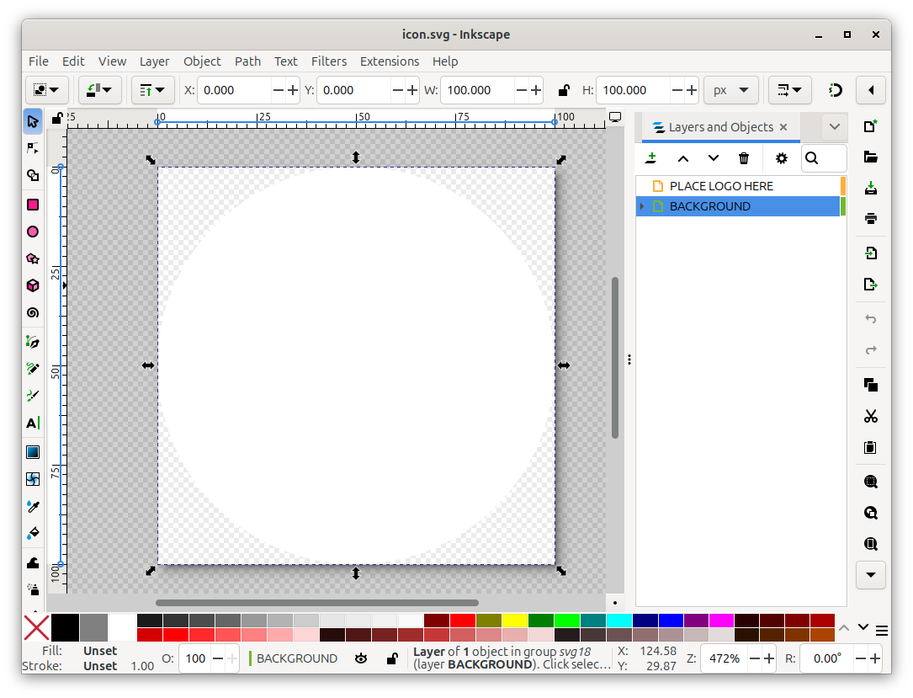
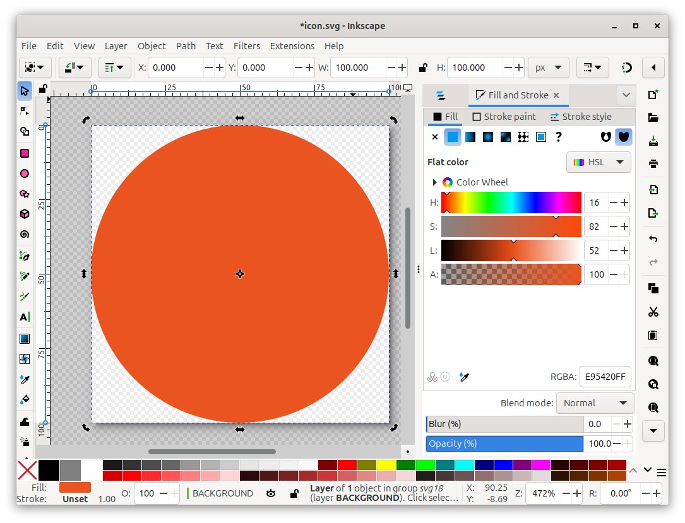
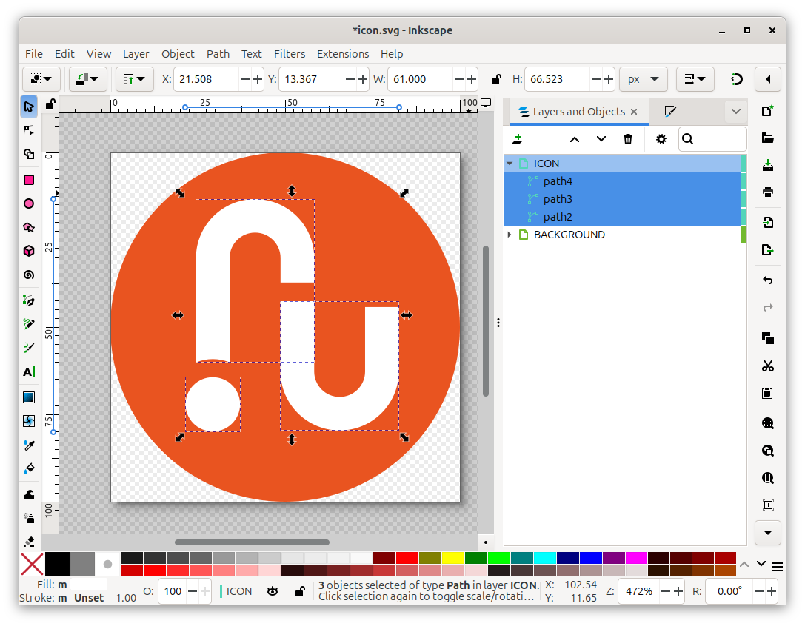

.. meta::
    :description: How to create, validate, and add an icon to a charm's Charmhub page.
                  Includes a demo of using Inkscape to draw the icon.

.. _manage-icons:
.. _how-to-add-an-icon:

Add an icon to Charmhub
=======================

Creating a custom icon for your charm is a great way to make it stand out on Charmhub.
This guide works through creating, validating, and adding an icon to your charm's
Charmhub page.

Install prerequisites
---------------------

You can create the icon with any vector graphics editor, but this guide works through
the process with Inkscape. If you're following along step by step, `install Inkscape
<https://inkscape-manuals.readthedocs.io/en/latest/installing-on-linux.html>`__.

Next, right-click on the following link to save the `icon template
<https://assets.ubuntu.com/v1/fc0260eb-icon.svg>`__ to your machine. Leave the file name
as ``icon.svg``.

Draw the icon in Inkscape
-------------------------

Open Inkscape and load the icon template you downloaded in the previous step.

To change the icon's background color, start by pressing :kbd:`Ctrl` + :kbd:`Shift` +
:kbd:`L` and clicking on :guilabel:`BACKGROUND` in the resulting tab.

With the background layer selected, press :kbd:`Ctrl` + :kbd:`Shift` + :kbd:`F` to open
the Fill and Stroke interface. You can then select a color for the background.

Next, go back to the layer selection window and select the :guilabel:`PLACE LOGO HERE`
layer. If you already have a vector image icon, drag it into this layer. If you have
a bitmap image, you'll need to convert it into a vector file first.

If you don't have an existing logo, you can use the drawing tools in Inkscape to create
one from scratch.

Once everything is to your liking, rename this layer to something more meaningful, like
:guilabel:`LOGO` or :guilabel:`ICON`.

Once you're happy with your icon, press :kbd:`Ctrl` + :kbd:`Shift` + :kbd:`S` and save
the file as ``icon.svg`` in the directory containing your charm's project file.

Validate the icon
-----------------

Go to the `Charmhub icon validator <https://charmhub.io/icon-validator>`_ and upload
your icon to check for any issues with its file type or dimensions. If you used the
provided template, this should pass without any issues.

To fix issues related to the icon's size, go back into Inkscape, press :kbd:`Ctrl` +
:kbd:`Shift` + :kbd:`D`, and set the height and width to 100 pixels.

.. _how-to-pack-the-icon-in-the-charm:

Pack the icon in the charm
--------------------------

For the icon to be displayed on Charmhub, it needs to be packed into the final charm
artifact. Ensure that the ``icon.svg`` file is present in the directory containing your
charm's project file.

If your charm's main part uses the Charm plugin, the icon will be packed in the final
charm by default.

For every other plugin, you need to explicitly add the ``icon.svg`` file to the charm
by adding a new part using the :ref:`craft_parts_dump_plugin` to your project file.

.. code-block:: yaml
    :caption: charmcraft.yaml

    parts:
      icon:
        plugin: dump
        source: .
        stage:
          - icon.svg

The next time you :ref:`publish the charm <publish-a-charm>` to its default track's
``stable`` channel, the icon will be displayed on Charmhub. Charmhub only updates the
charm's metadata on releases to the ``stable`` channel.

If you aren't ready for a ``stable`` release, you can add the icon by releasing and
then rolling back a revision. However, it's generally recommended you wait until
the charm is ready for a true ``stable`` release.
